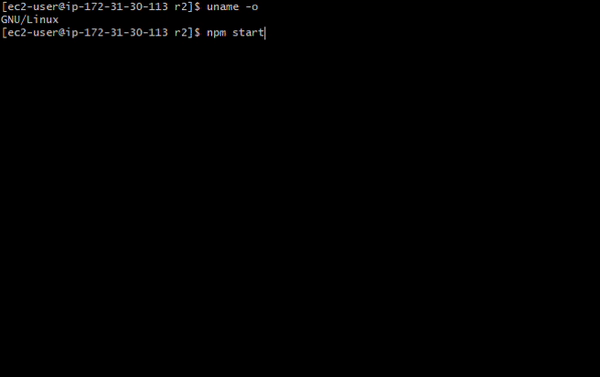

[日本語はこちら](http://qiita.com/bitrinjani/items/3ed756da9baf7d171306)

[](https://travis-ci.org/bitrinjani/r2) [](https://coveralls.io/github/bitrinjani/r2?branch=master)
# R2 Bitcoin Arbitrager

R2 Bitcoin Arbitrager is an automatic arbitrage trading application targeting Bitcoin exchanges operated in Japan.

This application is implemented with Node.js/TypeScript. The previous version was implemented by C# on .NET Framework in [Rinjani repository](https://github.com/bitrinjani/rinjani).



## Getting Started

1. Install [Node.js](https://nodejs.org) 8.5 or newer.
2. Clone this repository.
  ```bash
  git clone https://github.com/bitrinjani/r2.git
  ```
3. Run `npm install`. (or `yarn`)
```bash
cd r2
npm install
```
4. Rename `config_default.json` in src folder to `config.json`
5. Replace `key` and `secret` fields with your API keys (tokens) and secrets. 
6. Start the application by `npm start` or `yarn start`.
```bash
npm start
```

### Prerequisites
The application should work on any OS that supports Node.js, such as:
- Windows
- Mac OS
- Linux

#### Supported Exchanges
Currently, the Arbitrager supports three exchanges operated in Japan.

- Bitflyer (Cash)
- Quoine (Leverage)
- Coincheck (Cash, Leverage)

## How it works
1. Every 3 seconds, the Arbitrager fetches quotes from exchanges.
1. Verifies if the max net exposure (`maxNetExposure` config) is not breached.
1. Filters out quotes that are not usable for arbitrage. For example, if `maxShortPosition` config is 0 and the current position is 0 for a broker, the ask quotes for the broker are filtered out.
1. Calculates the best ask and the best bid from the filtered quotes. If the spread is not inverted, there is no arbitrage opportunity, so the arbitrager waits for the next iteration.
1. Verifies if there is enough expected profit. If the expected profit is smaller than `minTargetProfit` config, the Arbitrager waits for the next iteration.
1. Arbitrage the spread by sending a buy leg and a sell leg to each broker.
1. With 3 seconds interval, the Arbitrager checks if the legs are filled or not.
1. If the both legs are filled, shows the profit. 

## Configuration

All configurations are stored in `config.json`.

### Global Config
|Name|Values|Description|
|----|------|-----------|
|language|"ja" or "en"|UI language. Japanese or English.|
|demoMode|true or false|If it's True, the arbitrager analyzes spreads but doesn't send any trade.|
|priceMergeSize|number|Merges small quotes into the specified price ladder before analyzing arbitrage opportunity.|
|maxSize|number|Maximum BTC size to be sent to a broker.|
|minSize|number|Minimum BTC size to be sent to a broker.|
|minTargetProfit|number|Minimum profit in JPY to try to arbitrage.|
|minTargetProfitPercent|number|Minimum profit percentage against notional to try to abitrage. Profit percentage against notional is calculated by `100 * profit / (MID price * volume)`. When both minTargetProfit and minTargetProfitPercent is greater than zero, both are evaluated, meaning larger one will be effective.|
|iterationInterval|Millisecond|Time lapse in milliseconds of an iteration. When it's set to 3000, the quotes fetch and the spreads analysis for all the brokers are done every 3 seconds|
|positionRefreshInterval|Millisecond|Time lapse in milliseconds of position data refresh. Position data is used to check max exposure and long/short availability for each broker.|
|sleepAfterSend|Millisecond|Time lapse in milliseconds after one arbitrage is done.|
|maxNetExposure|number|Maximum total net exposure. If net exposure qty is larger than this value, Arbitrager stops.| 
|maxRetryCount|number|Maximum retry count to check if arbitrage orders are filled or not. If the orders are not filled after the retries, Arbitrager tries to cancel the orders and continues.|
|orderStatusCheckInterval|Millisecond|Time lapse in milliseconds to check if arbitrage orders are filled or not.|

### Broker config
|Name|Values|Description|
|----|------|-----------|
|broker|Bitflyer, Quoine or Coincheck|Broker enum|
|enabled|true or false|Enable the broker for arbitrage|
|key|string|Broker API Key or Token|
|secret|string|BrokerAPI Secret|
|maxLongPosition|number|Maximum long position allowed for the broker.|
|maxShortPosition|number|Maximum short position allowed for the broker|
|cashMarginType|Cash, MarginOpen, MarginClose, NetOut|Arbitrage order type. Not all options are supported for each exchange. See the table below.|
|commissionPercent|number|Comission percentage for each trade. Commission JPY amount is calculated by `target price * target volume * (commissionPercent / 100)`. Arbitrager calculates expected profit by `inversed spread * volume - commission JPY amount`.|  

#### Supported cashMarginType 

|Exchange|Supported option|
|--------|----------------|
|Bitflyer|Cash|
|Quoine|NetOut|
|Coincheck|Cash, MarginOpen, NetOut|

Quoine's NetOut is handled by Exchange API. Quoine can close multiple positions by one order.
Coincheck's NetOut is handled by R2 because the exchange doesn't support netout operation. Coincheck's NetOut works as below.
1. The arbitrager finds leverage positions with the following conditions.
  - The opposite side of the sending order
  - Almost same amount as the sending order. 'Almost same' here means within 1% difference
2. If the positions are found, the arbitrager closes the oldest one.
3. If not found, the arbitrager opens a new position.

Please note this implementation doesn't close multiple positions by one order.

### Log files
All log files are saved under `logs` directory.

|File name|Description|
|---------|-----------|
|info.log|Standard log file|
|debug.log|Verbose logging, including all REST HTTP requests and responses in JSON format|

## Running the tests
`test` script runs [ts-jest](https://github.com/kulshekhar/ts-jest).

```
npm test
```

## License

This project is licensed under the MIT License - see the [LICENSE](LICENSE) file for details

## Inspirations
[Blackbird](https://github.com/butor/blackbird), which targets US exchanges. 
